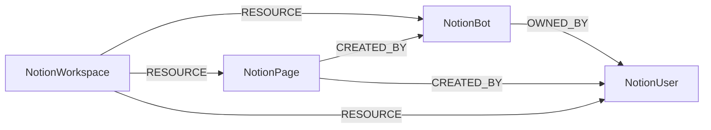

<!-- Generated from the data model. Do not edit manually. -->

## Notion Schema

### NotionBot

A Notion bot connection with the canonical ThirdPartyApp label.

> **Ontology Mapping**: This node uses the ontology label [`ThirdPartyApp`](#ontology-thirdpartyapp).

#### Properties

Ontology-generated fields are shown in *italics*.

| Field | Index | Description |
|-------|-------|-------------|
| id | Yes | Workspace-scoped Notion bot ID. |
| firstseen |  | Timestamp when a sync job first created this node. |
| lastupdated | Yes | Timestamp of the last sync that observed this node. |
| is_token_bot |  | Whether this bot is authenticated by the configured token. |
| name |  | Bot display name. |
| notion_user_id | Yes | Notion's bot user UUID. |
| owner_notion_user_id |  | Notion user UUID of the bot owner when available. |
| owner_type |  | Whether the bot is owned by a workspace or user. |
| *_ont_client_id* | Yes | Normalized field sourced from `id`. |
| *_ont_name* | Yes | Normalized field sourced from `name`. |
| *_ont_source* |  | Module that populated this node's ontology fields. |

#### Relationships

- `(:User)-[:AUTHORIZED]->(:NotionBot)`: generated by analysis job `Ontology - User AUTHORIZED ThirdPartyApp linking`.
  - Properties:

    | Field | Description |
    |-------|-------------|
    | scopes | Property generated by analysis job: `Ontology - User AUTHORIZED ThirdPartyApp linking`. |

- `(:NotionPage)-[:CREATED_BY]->(:NotionBot)`: A public Notion page was created by a workspace bot.

- `(:NotionBot)-[:OWNED_BY]->(:NotionUser)`: A Notion bot is owned by a Notion user when Notion exposes one.

- `(:NotionWorkspace)-[:RESOURCE]->(:NotionBot)`: A Notion workspace contains a bot connection.

### NotionPage

A connection-visible Notion page observed as published to the web.

#### Properties

| Field | Index | Description |
|-------|-------|-------------|
| id | Yes | Workspace-scoped Notion page ID. |
| firstseen |  | Timestamp when a sync job first created this node. |
| lastupdated | Yes | Timestamp of the last sync that observed this node. |
| created_by_notion_user_id |  | Notion user or bot UUID of the page creator. |
| created_time |  | Timestamp when the page was created. |
| in_trash |  | Whether the page is in the Notion trash. |
| is_locked |  | Whether the page is locked from editing in Notion. |
| is_public |  | Whether Notion reports that the page is published to the web. |
| last_edited_time |  | Timestamp when the page was last edited. |
| notion_page_id | Yes | Notion's page UUID. |
| parent_notion_id |  | Notion UUID of the immediate parent when it has one. |
| parent_type |  | Type of the page's immediate Notion parent. |
| public_url | Yes | Public web URL reported by Notion. |
| title |  | Page title when exposed to the connection. |
| url |  | Private Notion application URL for the page. |

#### Relationships

- `(:NotionPage)-[:CREATED_BY]->(:NotionBot)`: A public Notion page was created by a workspace bot.

- `(:NotionPage)-[:CREATED_BY]->(:NotionUser)`: A public Notion page was created by a workspace person.

- `(:NotionWorkspace)-[:RESOURCE]->(:NotionPage)`: A Notion workspace contains a public page observed by the connection.

### NotionUser

A Notion person with the canonical UserAccount label.

> **Ontology Mapping**: This node uses the ontology label [`UserAccount`](#ontology-useraccount).

#### Properties

Ontology-generated fields are shown in *italics*.

| Field | Index | Description |
|-------|-------|-------------|
| id | Yes | Workspace-scoped Notion user ID. |
| firstseen |  | Timestamp when a sync job first created this node. |
| lastupdated | Yes | Timestamp of the last sync that observed this node. |
| email | Yes | User email when exposed to the connection. |
| is_workspace_member |  | Whether the user was returned by Notion's member-only user list. |
| name |  | User display name. |
| notion_user_id | Yes | Notion's user UUID. |
| *_ont_email* | Yes | Normalized field sourced from `email`. |
| *_ont_fullname* | Yes | Normalized field sourced from `name`. |
| *_ont_source* |  | Module that populated this node's ontology fields. |
| *_ont_username* | Yes | Normalized field sourced from `email`. |

#### Relationships

- `(:NotionPage)-[:CREATED_BY]->(:NotionUser)`: A public Notion page was created by a workspace person.

- `(:User)-[:HAS_ACCOUNT]->(:NotionUser)`

- `(:NotionBot)-[:OWNED_BY]->(:NotionUser)`: A Notion bot is owned by a Notion user when Notion exposes one.

- `(:NotionWorkspace)-[:RESOURCE]->(:NotionUser)`: A Notion workspace contains a user account.

### NotionWorkspace

A Notion workspace with the canonical Tenant label.

> **Ontology Mapping**: This node uses the ontology label [`Tenant`](#ontology-tenant).

#### Properties

Ontology-generated fields are shown in *italics*.

| Field | Index | Description |
|-------|-------|-------------|
| id | Yes | Stable Notion workspace ID. |
| firstseen |  | Timestamp when a sync job first created this node. |
| lastupdated | Yes | Timestamp of the last sync that observed this node. |
| name | Yes | Notion workspace name, or its stable ID when the name is unavailable. |
| token_bot_notion_user_id |  | Notion user UUID of the bot authenticated by this workspace token. |
| *_ont_name* | Yes | Normalized field sourced from `name`. |
| *_ont_source* |  | Module that populated this node's ontology fields. |

#### Relationships

- `(:NotionWorkspace)-[:RESOURCE]->(:NotionBot)`: A Notion workspace contains a bot connection.

- `(:NotionWorkspace)-[:RESOURCE]->(:NotionPage)`: A Notion workspace contains a public page observed by the connection.

- `(:NotionWorkspace)-[:RESOURCE]->(:NotionUser)`: A Notion workspace contains a user account.
