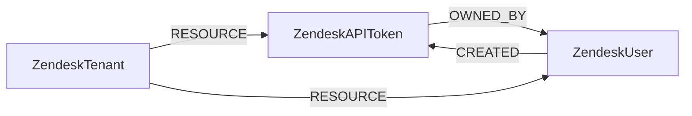

<!-- Generated from the data model. Do not edit manually. -->

## Zendesk Schema

### ZendeskAPIToken

Legacy API-token metadata for a Zendesk account; no values or prefixes.

> **Ontology Mapping**: This node has the extra label `APIKey` to enable
cross-platform queries for API keys. Description, creation and modification
times, and last use map to the corresponding ontology fields.

Source API: `GET /api/v2/api_tokens?include_users=true` (`ListApiTokens`),
documented in [Zendesk's official OpenAPI specification](https://developer.zendesk.com/zendesk/oas.yaml)
under `ApiTokenObject` and `ApiTokensResponse`.

The creator is distinct from the token's authentication authority. See
[Zendesk's API token documentation](https://support.zendesk.com/hc/en-us/articles/4408889192858-Managing-API-token-access-to-the-Zendesk-API).
Tokens whose creators or assignees are absent from the staff inventory retain
their user IDs without CREATED or OWNED_BY relationships. OAuth tokens are not
inventoried.
Zendesk schedules this endpoint for removal on April 30, 2027.

> **Ontology Mapping**: This node uses the ontology label [`APIKey`](#ontology-apikey).

#### Properties

Ontology-generated fields are shown in *italics*.

| Field | Index | Description |
|-------|-------|-------------|
| id | Yes | Tenant-scoped ID: subdomain:token_id. |
| firstseen |  | Timestamp when a sync job first created this node. |
| lastupdated | Yes | Timestamp of the last sync that observed this node. |
| active |  | Whether the token can be used to authenticate API requests. |
| assigned_user_id |  | Assigned agent or admin ID, if returned by Zendesk. Distinct from the creator. |
| created_at |  | Token creation time (ISO 8601). |
| creator_user_id |  | Creator's user ID, from the API's user_id field with include_users=true; not an authentication identity. |
| description |  | Token description displayed in Admin Center. |
| last_used |  | Last authentication time (ISO 8601), or null if never used. |
| token_id | Yes | Native legacy API token ID; never the token value. |
| updated_at |  | Token modification time (ISO 8601). |
| *_ont_created_at* | Yes | Normalized field sourced from `created_at`. |
| *_ont_last_used_at* | Yes | Normalized field sourced from `last_used`. |
| *_ont_name* | Yes | Normalized field sourced from `description`. |
| *_ont_source* |  | Module that populated this node's ontology fields. |
| *_ont_updated_at* | Yes | Normalized field sourced from `updated_at`. |

#### Relationships

- `(:ZendeskUser)-[:CREATED]->(:ZendeskAPIToken)`: Links an API token to the staff account that created it, not who can use it.

- `(:ZendeskAPIToken)-[:OWNED_BY]->(:ZendeskUser)`: Links an API token to the agent or admin it is assigned to.

- `(:User)-[:OWNS]->(:ZendeskAPIToken)`: generated by analysis job `Ontology - User OWNS APIKey linking`.

- `(:ZendeskTenant)-[:RESOURCE]->(:ZendeskAPIToken)`: Contains a Zendesk resource within its account and scopes its cleanup.

### ZendeskTenant

A Zendesk account, identified by its configured subdomain.

Ontology Mapping: The extra label `Tenant` enables cross-platform tenant queries.

This node is constructed from the configured account subdomain, following
[Zendesk's API URL conventions](https://developer.zendesk.com/api-reference/introduction/doc-conventions/).
It is not an Organizations API object or a separately fetched account record.

> **Ontology Mapping**: This node uses the ontology label [`Tenant`](#ontology-tenant).

#### Properties

Ontology-generated fields are shown in *italics*.

| Field | Index | Description |
|-------|-------|-------------|
| id | Yes | Normalized Zendesk subdomain. |
| firstseen |  | Timestamp when a sync job first created this node. |
| lastupdated | Yes | Timestamp of the last sync that observed this node. |
| domain |  | Zendesk account hostname. |
| *_ont_domain* | Yes | Normalized field sourced from `domain`. |
| *_ont_name* | Yes | Normalized field sourced from `id`. |
| *_ont_source* |  | Module that populated this node's ontology fields. |

#### Relationships

- `(:ZendeskTenant)-[:RESOURCE]->(:ZendeskAPIToken)`: Contains a Zendesk resource within its account and scopes its cleanup.

- `(:ZendeskTenant)-[:RESOURCE]->(:ZendeskUser)`: Contains a Zendesk resource within its account and scopes its cleanup.

### ZendeskUser

A Zendesk CX agent or administrator, including light and suspended agents.

End users are excluded. Ontology Mapping: This node has the extra label
`UserAccount` to enable cross-platform queries for user accounts.

Source API: [Zendesk List Users](https://developer.zendesk.com/api-reference/ticketing/users/users/#list-users),
filtered to agent and admin roles.

> **Ontology Mapping**: This node uses the ontology label [`UserAccount`](#ontology-useraccount).

#### Properties

Ontology-generated fields are shown in *italics*.

| Field | Index | Description |
|-------|-------|-------------|
| id | Yes | Tenant-scoped ID: subdomain:user_id. |
| firstseen |  | Timestamp when a sync job first created this node. |
| lastupdated | Yes | Timestamp of the last sync that observed this node. |
| active |  | Whether the user has not been deleted. |
| created_at |  | Account creation time (ISO 8601). |
| custom_role_id |  | Custom agent role ID, if assigned. |
| email | Yes | User email address. |
| last_login_at |  | Last login time (ISO 8601). |
| name |  | User display name. |
| role |  | Staff role: agent or admin. |
| role_type |  | Zendesk agent role type, including light agents. |
| suspended |  | Whether the user is suspended. |
| updated_at |  | Last modification time (ISO 8601). |
| user_id |  | Native Zendesk user ID. |
| *_ont_active* | Yes | Normalized field sourced from `suspended`. |
| *_ont_email* | Yes | Normalized field sourced from `email`. |
| *_ont_fullname* | Yes | Normalized field sourced from `name`. |
| *_ont_lastactivity* | Yes | Normalized field sourced from `last_login_at`. |
| *_ont_source* |  | Module that populated this node's ontology fields. |

#### Relationships

- `(:ZendeskUser)-[:CREATED]->(:ZendeskAPIToken)`: Links an API token to the staff account that created it, not who can use it.

- `(:User)-[:HAS_ACCOUNT]->(:ZendeskUser)`

- `(:ZendeskAPIToken)-[:OWNED_BY]->(:ZendeskUser)`: Links an API token to the agent or admin it is assigned to.

- `(:ZendeskTenant)-[:RESOURCE]->(:ZendeskUser)`: Contains a Zendesk resource within its account and scopes its cleanup.
