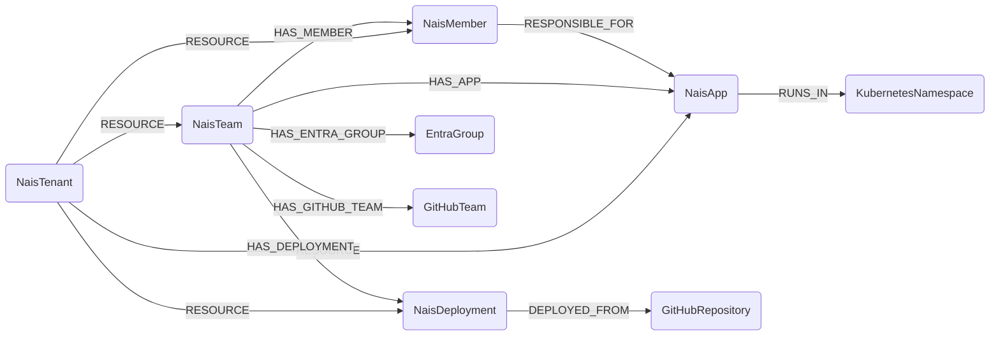

## NAIS Schema



:::{hint}
`RESPONSIBLE_FOR` and pod-level `DEPLOYED_FROM` relationships are created by analysis jobs that run
after the base data is ingested.  They will only appear once both NAIS data **and** the relevant
cross-module data (Kubernetes, GitHub) have been synced at least once.
:::

---

### NaisTenant

Represents the NAIS Console API endpoint (one per organisation / environment pair).

| Field | Description |
|-------|-------------|
| firstseen | Timestamp of when a sync job first created this node |
| lastupdated | Timestamp of the last time the node was updated |
| id | Base URL of the NAIS Console GraphQL endpoint |

#### Relationships

- All NAIS resources belong to a tenant.
    ```
    (:NaisTenant)-[:RESOURCE]->(:NaisTeam)
    (:NaisTenant)-[:RESOURCE]->(:NaisMember)
    (:NaisTenant)-[:RESOURCE]->(:NaisApp)
    (:NaisTenant)-[:RESOURCE]->(:NaisDeployment)
    ```

---

### NaisTeam

Represents a NAIS team.  The `slug` field also equals the Kubernetes namespace name used by
all workloads owned by this team.

| Field | Description |
|-------|-------------|
| firstseen | Timestamp of when a sync job first created this node |
| lastupdated | Timestamp of the last time the node was updated |
| id | NAIS internal team ID |
| slug | Team slug (also the Kubernetes namespace name) |
| purpose | Human-readable team purpose |
| slack_channel | Slack channel for the team |
| last_successful_sync | ISO-8601 timestamp of the last successful NAIS sync |
| entra_group_id | Azure Entra ID group ID (used to link `EntraGroup`) |
| github_team_slug | GitHub team slug (used to link `GitHubTeam`) |
| google_group_email | Google Workspace group email |

#### Relationships

- Team belongs to a tenant.
    ```
    (:NaisTenant)-[:RESOURCE]->(:NaisTeam)
    ```
- Team has members.
    ```
    (:NaisTeam)-[:HAS_MEMBER]->(:NaisMember)
    ```
- Team has workloads.
    ```
    (:NaisTeam)-[:HAS_APP]->(:NaisApp)
    ```
- Team has deployments.
    ```
    (:NaisTeam)-[:HAS_DEPLOYMENT]->(:NaisDeployment)
    ```
- Team is linked to its Entra ID group (requires Entra module).
    ```
    (:NaisTeam)-[:HAS_ENTRA_GROUP]->(:EntraGroup)
    ```
- Team is linked to its GitHub team (requires GitHub module).
    ```
    (:NaisTeam)-[:HAS_GITHUB_TEAM]->(:GitHubTeam)
    ```
- Team members are responsible for the team's apps (analysis job).
    ```
    (:NaisMember)-[:RESPONSIBLE_FOR]->(:NaisApp)
    ```

---

### NaisMember

Represents a user who is a member of at least one NAIS team.

> **Ontology Mapping**: This node has the extra label `UserAccount` to enable cross-platform
> queries for user accounts across different systems (e.g. EntraUser, GitHubUser).
> The join key is `email`.

| Field | Description |
|-------|-------------|
| firstseen | Timestamp of when a sync job first created this node |
| lastupdated | Timestamp of the last time the node was updated |
| id | NAIS internal user ID |
| email | User email address (primary identifier for cross-module mapping) |
| name | Full name |
| external_id | External identity provider ID |

#### Relationships

- Member belongs to a tenant.
    ```
    (:NaisTenant)-[:RESOURCE]->(:NaisMember)
    ```
- Member belongs to a team.
    ```
    (:NaisTeam)-[:HAS_MEMBER]->(:NaisMember)
    ```
- Member is responsible for apps in their teams (analysis job).
    ```
    (:NaisMember)-[:RESPONSIBLE_FOR]->(:NaisApp)
    ```

---

### NaisApp

Represents a NAIS workload — either an `Application` or a `Job`.

| Field | Description |
|-------|-------------|
| firstseen | Timestamp of when a sync job first created this node |
| lastupdated | Timestamp of the last time the node was updated |
| id | NAIS internal workload ID |
| name | Workload name |
| workload_type | `"Application"` or `"Job"` |
| team_slug | Owning team slug (also the Kubernetes namespace) |
| environment | NAIS environment name (e.g. `prod`, `dev`) |
| gcp_project_id | GCP project ID for this team/environment combination |
| image_name | Container image repository |
| image_tag | Container image tag (typically a git commit SHA) |
| state | Current NAIS workload state |
| ingresses | List of public ingress hostnames |

#### Relationships

- App belongs to a tenant.
    ```
    (:NaisTenant)-[:RESOURCE]->(:NaisApp)
    ```
- App is owned by a team.
    ```
    (:NaisTeam)-[:HAS_APP]->(:NaisApp)
    ```
- App runs in a Kubernetes namespace (requires Kubernetes module).
    ```
    (:NaisApp)-[:RUNS_IN]->(:KubernetesNamespace)
    ```
- Team members are responsible for the app (analysis job).
    ```
    (:NaisMember)-[:RESPONSIBLE_FOR]->(:NaisApp)
    ```

---

### NaisDeployment

Represents a deployment event from GitHub Actions to a NAIS environment.

| Field | Description |
|-------|-------------|
| firstseen | Timestamp of when a sync job first created this node |
| lastupdated | Timestamp of the last time the node was updated |
| id | NAIS internal deployment ID |
| created_at | ISO-8601 timestamp of the deployment |
| team_slug | Deploying team slug |
| environment_name | Target NAIS environment |
| repository | GitHub repository in `"org/repo"` format |
| deployer_username | GitHub username of the person who triggered the deployment |
| commit_sha | Git commit SHA that was deployed |
| trigger_url | GitHub Actions run URL |

#### Relationships

- Deployment belongs to a tenant.
    ```
    (:NaisTenant)-[:RESOURCE]->(:NaisDeployment)
    ```
- Deployment belongs to a team.
    ```
    (:NaisTeam)-[:HAS_DEPLOYMENT]->(:NaisDeployment)
    ```
- Deployment originates from a GitHub repository (requires GitHub module).
    ```
    (:NaisDeployment)-[:DEPLOYED_FROM]->(:GitHubRepository)
    ```

---

## Example queries

**Who is responsible for a pod running in production?**

```cypher
MATCH (m:NaisMember)-[:RESPONSIBLE_FOR]->(a:NaisApp {environment: "prod"})
RETURN m.email, a.name, a.team_slug
ORDER BY a.team_slug, a.name
```

**Trace a GitHub commit to running pods:**

```cypher
MATCH (d:NaisDeployment {commit_sha: $sha})-[:DEPLOYED_FROM]->(r:GitHubRepository)
MATCH (d)<-[:HAS_DEPLOYMENT]-(t:NaisTeam)-[:HAS_APP]->(a:NaisApp)
MATCH (a)-[:RUNS_IN]->(ns:KubernetesNamespace)<-[:MEMBER_OF]-(p:KubernetesPod)
RETURN d.repository, t.slug, a.name, p.name
```

**Find all NAIS apps for an Entra group:**

```cypher
MATCH (eg:EntraGroup {id: $groupId})<-[:HAS_ENTRA_GROUP]-(t:NaisTeam)-[:HAS_APP]->(a:NaisApp)
RETURN t.slug, a.name, a.environment
```
